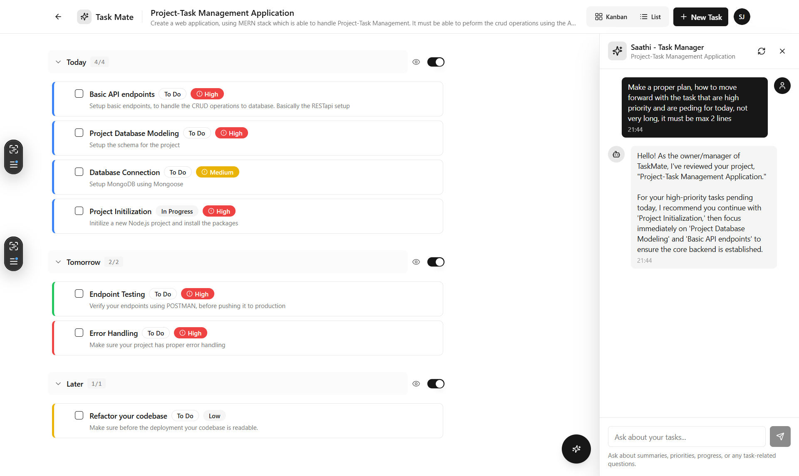

# Task Mate 📋

Modern task management application with AI-powered productivity features. Built with React, Node.js, and Google Gemini AI.

Demo: [https://task-mate-sigma.vercel.app/](https://task-mate-sigma.vercel.app/)

## ✨ Features

- 🔐 **Secure Authentication** - JWT-based login with refresh tokens
- 📊 **Multiple Views** - Switch between Kanban board and List view
- 🎨 **Visual Organization** - Color-coded priorities and custom task colors
- 🤖 **AI Assistant** - Context-aware chat for productivity insights
- 📱 **Fully Responsive** - Optimized for mobile, tablet, and desktop
- 🎯 **Smart Sections** - Organize tasks by Today, Tomorrow, Later



## 🚀 Quick Start

### Prerequisites
- Node.js 16+
- MongoDB Atlas account (or local MongoDB)
- Google Gemini API key

### 1. Clone Repository

```bash
git clone <repository-url>
cd task-mate
```

### 2. Setup Backend

```bash
cd backend
npm install
npm run setup          # Creates .env template
# Edit .env with your credentials
npm run dev           # Starts on http://localhost:5000
```

### 3. Setup Frontend

```bash
cd frontend
npm install
# Create .env file:
echo "VITE_API_URL=http://localhost:5000" > .env
npm run dev           # Starts on http://localhost:5173
```

### 4. Open Application

Navigate to `http://localhost:5173` and create your account!

## 📚 Documentation

- **[Backend Documentation](./backend/README.md)** - API endpoints, setup, environment variables
- **[Frontend Documentation](./frontend/README.md)** - UI components, architecture, deployment

## 🏗️ Tech Stack

### Frontend
- React 18 + TypeScript
- Vite (build tool)
- Tailwind CSS + shadcn/ui
- React Router v6
- Axios
- @dnd-kit (drag & drop)

### Backend
- Node.js + Express
- MongoDB + Mongoose
- JWT Authentication
- Google Gemini AI
- Winston (logging) -> Used for Debugging

## 🎯 Project Structure

```
task-mate/
├── backend/           # Node.js API server
│   ├── src/
│   │   ├── controllers/
│   │   ├── models/
│   │   ├── routes/
│   │   ├── services/
│   │   └── middleware/
│   └── README.md     # Backend docs
│
└── frontend/         # React application
    ├── src/
    │   ├── components/
    │   ├── pages/
    │   ├── contexts/
    │   └── services/
    └── README.md     # Frontend docs
```

## 🔑 Environment Setup

### Backend `.env`

```env
PORT=5000
MONGODB_URI=your_mongodb_connection_string
JWT_SECRET=your_jwt_secret
JWT_REFRESH_SECRET=your_refresh_secret
GEMINI_API_KEY=your_gemini_api_key
CORS_ORIGIN=http://localhost:5173
```

**Get API Keys:**
- MongoDB: [MongoDB Atlas](https://www.mongodb.com/cloud/atlas)
- Gemini: [Google AI Studio](https://makersuite.google.com/app/apikey)

### Frontend `.env`

```env
VITE_API_URL=http://localhost:5000
```

## 📡 API Overview

All endpoints require authentication except login/register.

**Base URL**: `http://localhost:5000/api`

### Key Endpoints

| Method | Endpoint              | Description       |
| ------ | --------------------- | ----------------- |
| POST   | `/auth/register`      | Create account    |
| POST   | `/auth/login`         | Login             |
| GET    | `/projects`           | Get all projects  |
| POST   | `/projects`           | Create project    |
| GET    | `/projects/:id/tasks` | Get project tasks |
| POST   | `/projects/:id/tasks` | Create task       |
| POST   | `/ai/chat`            | Chat with AI      |

See [Backend README](./backend/README.md) for complete API documentation.

## 🚀 Deployment

### Backend (Deployed on Render)

1. Push code to GitHub
2. Create new Web Service on Render
3. `npm install` as build command
4. `npm start` as start command
5. **Update `CORS_ORIGIN` to your frontend URL**

### Frontend (Deployed on Vercel)

1. Connect Git repository
2. Build command: `npm run build`
3. Output directory: `dist`
4. Set `VITE_API_URL` environment variable

## 🛠️ Development

### Run Both Servers

**Terminal 1 - Backend:**
```bash
cd backend && npm run dev
```

**Terminal 2 - Frontend:**
```bash
cd frontend && npm run dev
```
## 🔧 Troubleshooting

**API Connection Failed**:
- Check backend is running on port 5000
- Verify `VITE_API_URL` in frontend `.env`
- Check CORS settings in backend `.env`

**Database Connection Error**:
- Verify MongoDB URI is correct
- Check network access in MongoDB Atlas
- Ensure IP whitelist includes your IP **(This gave me a hard time! Really important step!)**

**AI Features Not Working**:
- Verify `GEMINI_API_KEY` is set
- Check API key is valid at Google AI Studio
- Review backend logs for errors
